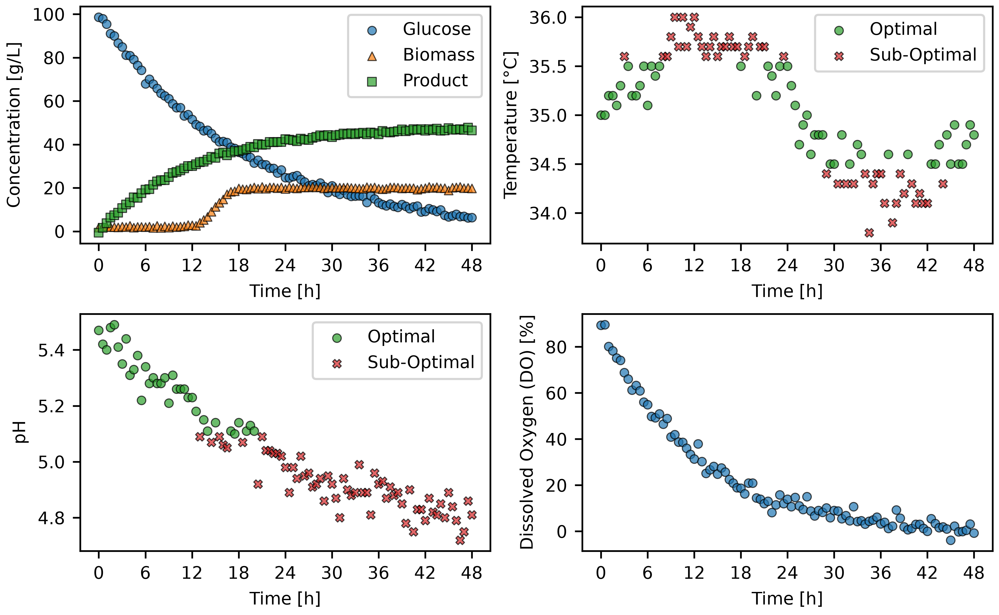

# Assignment 1: Bioprocess Monitoring with Python

## Background

Fermentation processes can be monitored continuously to ensure that their operating conditions remain within acceptable
limits. Variables such as pH and temperature can strongly influence cell growth and productivity.

To enable bioprocess monitoring, you will create a Python class called `BioprocessMonitor` that automates:

1. Batch extraction from a fermentation dataset.
2. Identification of measurements within acceptable operating ranges.
3. Generation of dashboard figures.
4. Creation of batch-level summary tables.

## Task

- Your task for this assignment is to create a Python class called `BioprocessMonitor` that will export dashboards and
  summary tables from fermentation batch process data.

- You are provided with a template of the `BioprocessMonitor` class in the [`classes.py`](provided_files/classes.py)
  file. Detailed specifications are provided for each method.

- You must also include a `README.md` file which has the following structure:
    - Project Name (Come up with a name for your project)
        - One sentence description.
    - Overview
        - What were the goals/objectives of this project?
    - Features
        - What does your custom Python class do?
    - Technologies used
        - Python + Libraries used, including version numbers.
        - Note: You may have many libraries installed in your environment, but here you should only mention the ones you
          actually used.
    - Code design
        - Describe what your code does after you run `main.py`.
    - Dashboard
        - Choose one of the dashboards generated by your code and embed it in your README.
        - Describe the dashboard.
    - Summary table
        - Choose one of the summary tables generated by your code and embed it in your README.
        - You can use this website to convert CSV to Markdown: https://convertcsv.com/csv-to-markdown.htm
        - Describe the summary table.
- You should present your repository like a portfolio project rather than an assignment for a course. I would encourage
  you not to make any references to the course (e.g., course code, course name, assignment number, student ID, etc.).

### An example of the type of dashboards you will develop:

### An example of the type of summary tables you will develop:

| batch_id | ph_optimal_percent | temperature_optimal_percent | C_product_g_L^-1_final |
|----------|--------------------|-----------------------------|------------------------|
| 1        | 93.81              | 97.94                       | 46.5                   |
| 2        | 96.69              | 97.52                       | 50.8                   |
| 3        | 95.89              | 93.15                       | 44.6                   |
| 4        | 100.0              | 96.47                       | 48.6                   |
| 5        | 48.62              | 99.08                       | 24.7                   |

## Setting up your assignment

1. Download the [repository template](https://github.com/Shawn-Chahal/chg4360c-repo-template) for the course.

2. Replace `main.py` and `classes.py` in your local repository, with the equivalent files found in the
   [`provided_files`](provided_files/) directory.

3. Add [`dataset_fermentation.csv`](provided_files/dataset_fermentation.csv) to the `datasets` directory in your local
   repository.

4. When you open the project in PyCharm, make sure that you have the course environment selected in the bottom-right
   corner.

5. Make sure you replaced any placeholder files from the repository template with the appropriate content and deleted
   any placeholder files that you are not using.

## Provided files

[`main.py`](provided_files/main.py)

- You can use `main.py` to test your `BioprocessMonitor` class. It demonstrates how the `BioprocessMonitor` class will
  be used and serves as a specification for your implementation.

- This script has already been completed and should not be modified. If you do decide to modify it, make sure to revert
  it back to its original state when running your final tests.

[`classes.py`](provided_files/classes.py)

- This file contains the template of the `BioprocessMonitor` class.

- Your task is to implement all missing functionality according to the specifications provided within each method.

[`dataset_fermentation.csv`](provided_files/dataset_fermentation.csv)

- This file contains simulated fermentation data with the following columns:

    - `batch_id`: The identification number of the batch. Each batch run is assigned a unique Batch ID.
    - `time_h`: The time the measurement was taken at in units of hours.
    - `temperature_C`: The temperature in units of °C.
    - `pH`: The pH.
    - `DO_percent`: Dissolved oxygen in units of '%'.
    - `C_glucose_g_L^-1`: Glucose concentration in units of g/L.
    - `C_biomass_g_L^-1`: Biomass concentration in units of g/L.
    - `C_product_g_L^-1`: Product concentration in units of g/L.

## Expected Program Behavior

The provided `main.py` script should run without modification.

When `main.py` is run, it should generate:

- a figure for each mode and batch in the `figures` directory.
    - An example figure for Batch 1, Mode B can be found [here](example_results/Batch_001_Mode_B.png).
- a table for each mode in the `tables` directory.
    - An example table for Mode A can be found [here](example_results/Summary_Mode_A.csv).

## Submission Requirements

- Submit a link to your GitHub repository through the Brightspace assignment page.

- The timestamp of your submission will be whichever is latest between the timestamp of the last commit in your GitHub
  repository and the timestamp of your Brightspace submission.

## Rubric

| Component               | Weight |
|-------------------------|--------|
| Repository organization | 20%    |
| Code execution          | 20%    |
| Dashboard               | 20%    |
| Summary table           | 20%    |
| README.md               | 20%    |

