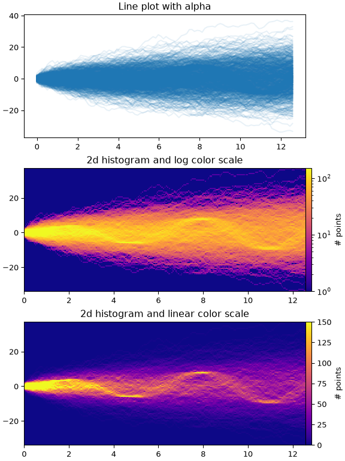

# Getting Started

This document will guide you through installing the required software and setting up the course's development
environment.

**Course demonstrations are based on Conda and PyCharm running on Windows 11.**

If you are using a different package manager, IDE, or OS, you may occasionally notice minor differences between your
development environment and the one demonstrated in class. These differences are normal and typically do not affect the
underlying concepts or functionality of the code.

## Step 1: Install Git

Git is used for version control, to connect to GitHub, and submit your work.

1. Download Git from: https://git-scm.com/install/
2. Run the installer.
3. I recommend changing the following settings during installation. You may use the default settings for everything
   else.
    1. Select Components: Uncheck *Windows Explorer integration*.
    2. Choosing the default editor used by Git: Select *Use Notepad as Git's default editor*.
    3. Adjusting the name of the initial branch in new repositories: Select: *Override the default branch name for new
       repositories* and type *main* in the text box.

## Step 2: Install Miniconda

Miniconda provides a lightweight Python distribution and package manager.

1. Download Miniconda from: https://www.anaconda.com/download/success?reg=skipped
2. Run the installer.
3. I recommend changing the following settings during installation. You may use the default settings for everything
   else.
    1. Advanced Installation Options: Check *Register Miniconda3 as my default Python*.
    2. Advanced Installation Options: Check *Clear the package cache upon completion*.

## Step 3: Install PyCharm

PyCharm will be our integrated development environment (IDE).

1. Download PyCharm from: https://www.jetbrains.com/pycharm/
2. Run the installer.
3. I recommend changing the following settings during installation. You may use the default settings for everything
   else.
    1. Installation Options: Check *.py*.

## Step 4: Create the conda environment

A conda environment contains the installation of Python and external libraries. We will use the same environment
throughout the course to minimize differences in code execution.

1. Open PyCharm.
2. File > New Project
3. Choose your preferred **Location** to save this project. Name the folder `chg4360c-demo`.
4. Uncheck *Create Git repository*.
5. Uncheck *Create a welcome script*.
6. Click *Base conda*.
    1. If you receive an error saying **“No conda executable found”**, follow the [troubleshooting guide](#troubleshooting-guide) to locate and select the Conda executable manually.
7. Click *Create*.
8. There will be a blue progress bar in the bottom-right corner. It will shift through different cycles. Wait until it
   is completely finished before moving on to the next step.
9. Click the **Terminal** icon in the bottom-left corner (Usually looks something like this: **| >_ |**).
10. Wait for the terminal to fully load. It should say **(base)** followed by the location of your project.
11. Copy the following command into the terminal and press ENTER.

```
conda update --name base conda
```

12. Follow any instructions in the terminal, then wait for the installation to finish.
13. Copy the following command into the terminal and press ENTER.

```
conda create --name chg4360c-fall2026 python=3.14.7 matplotlib=3.11.0 numpy=2.5.2 pandas=3.0.5 scikit-learn=1.9.0 scipy=1.18.0
```

14. Follow any instructions in the terminal, then wait for the installation to finish.
15. Close the Terminal by clicking “x” in the tab next to Terminal. Do not minimize it.
16. Click **miniconda3** in the bottom-right corner.
17. Click **Add New Interpreter > Add Local Interpreter**.
18. Use the following settings:
    1. Environment: Select existing
    2. Type: Conda
    3. Environment: chg4360c-fall2026
19. Click *OK*.
20. There will be a blue progress bar in the bottom-right corner. It will shift through different cycles. Wait until it
    is completely finished before moving on to the next step.
21. Open the Terminal.
22. Wait for the terminal to fully load. It should say **(chg4360c-fall2026)** followed by the location of your project.
23. Copy the following command into the terminal and press ENTER:

```
pip install torch==2.13.0 torchvision==0.28.0
```

24. Follow any instructions in the terminal, then wait for the installation to finish.
25. There will be a blue progress bar in the bottom-right corner. It will shift through different cycles. Wait until it
    is completely finished before moving on to the next step.
26. Copy the following command into the terminal and press ENTER:

```
conda export > environment.yaml
```

27. Open the newly generated `environment.yaml` file and verify that all the libraries have installed.
28. You have now created and activated the `chg4360c-fall2026` environment. Use this environment for all course projects
    and assignments unless instructed otherwise. Using the same environment will help ensure that you, your group
    members, the instructor, and the course materials all use consistent versions of Python and the required libraries.

## Step 5: Test the conda environment

Now that you have created and activated the `chg4360c-fall2026` environment, you can test to see that it is working as
intended.

1. Download [`test_environment.py`](test_environment.py) to your project folder (i.e., `chg4360c-demo`).
2. Run `test_environment.py`, by right-clicking its tab when open in PyCharm and clicking *Run 'test_environment'*.
3. If the code ran successfully then:
    1. The Terminal should show:

    ```
    matplotlib    3.11.0
    numpy         2.5.2
    pandas        3.0.5
    scikit-learn  1.9.0
    scipy         1.18.0
    torch         2.13.0+cpu
    
    Process finished with exit code 0
    ```

    2. A new file called [`test_figure.png`](test_figure.png) should be generated in the project folder:

   

## Step 6: Connect to GitHub

Git is a version control system that tracks changes to files and code. GitHub is an online platform that uses Git to
store, share, and collaborate on projects online.

1. Create a free GitHub account at: https://github.com/
2. Create a new repository at: https://github.com/new
    1. Repository name: *chg4360c-demo*
    2. Choose visibility: *Public*
    3. Add README: *Off*
    4. Add .gitignore: *No .gitignore*
    5. Add license: *No license*
    6. Click *Create repository*


3. Create a file in your PyCharm project root called `.gitignore`.
4. Open `.gitignore` in PyCharm and copy the following text in it:

```
.idea/
__pycache__/
```

5. Create a file in your project root called `README.md`.
6. Open `README.md` in PyCharm and copy the following text in it:

```
# CHG 4360-C (Fall 2026)
## Machine Learning Applied to Biochemical Engineering

This is my first commit.
```

7. For your first commit, enter these lines one-by-one in the PyCharm terminal. Replace `<username>` with your GitHub
   username and `<repository>` with the name of your GitHub repository.

```
git init
git add .
git commit -m "First commit"
git branch -M main
git remote add origin https://github.com/<username>/<repository>.git
git push -u origin main
```

8. Refresh the web page for your repository on GitHub. It should be updated to show your project files.

9. Open `README.md` in PyCharm and copy the following text in it:

```
# CHG 4360-C (Fall 2026)
## Machine Learning Applied to Biochemical Engineering

This is my second commit.
```

10. Now that your local project is connected to your GitHub repository, for all future commits, enter these lines
    one-by-one in the PyCharm terminal. Replace `<message>` with your own message that describes the changes you made
    since the last commit.

```
git add .
git commit -m "<message>"
git push
```

11. Refresh the web page for your repository on GitHub. It should be updated to show your project files.

## Troubleshooting guide

### “No conda executable found”

PyCharm may display the error **“No conda executable found”** if it cannot automatically locate your Miniconda
installation. Follow the instructions below to locate and select the Conda executable manually. The location of the
Conda executable depends on your operating system and the options you selected when installing Miniconda.

#### Windows

On Windows, the Conda executable is usually named conda.exe. It may be installed in one of the following locations:

- `C:\Users\<your-username>\miniconda3\Scripts\conda.exe`
- `C:\Users\<your-username>\Miniconda3\Scripts\conda.exe`
- `C:\Users\<your-username>\AppData\Local\miniconda3\Scripts\conda.exe`
- `C:\Users\<your-username>\AppData\Local\Miniconda3\Scripts\conda.exe`
- `C:\ProgramData\miniconda3\Scripts\conda.exe`
- `C:\ProgramData\Miniconda3\Scripts\conda.exe`

Replace `<your-username>` with your Windows username. The AppData folder may be hidden. To open it, enter the following
location in the File Explorer address bar and press ENTER:

```
%LOCALAPPDATA%
```

You can also try locating Conda automatically. Open Anaconda Prompt, type the following command, and press ENTER:

```
where conda
```

This command may display more than one result. Look for a location that ends with:
conda.exe

#### macOS

On macOS, the Conda executable may be installed in one of the following locations:

- `/Users//miniconda3/bin/conda`
- `/Users//opt/miniconda3/bin/conda`
- `/opt/miniconda3/bin/conda`

Replace with your macOS username where relevant. You can also try locating Conda automatically. Open Terminal, type the
following command, and press ENTER:

```
which conda
```

#### Linux

On Linux, the Conda executable may be installed in one of the following locations:

- `/home//miniconda3/bin/conda`
- `/home//opt/miniconda3/bin/conda`
- `/opt/miniconda3/bin/conda`

Replace with your Linux username where relevant. You can also try locating Conda automatically. Open Terminal, type the
following command, and press ENTER:

```
which conda
```
